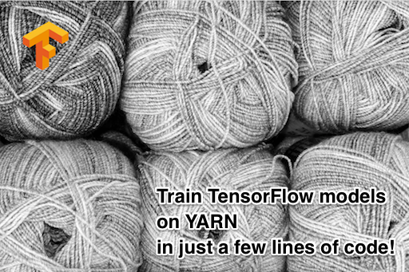

tf-yarnᵝ
========



Installation
------------

```bash
$ git clone https://github.com/criteo/tf-yarn
$ cd tf-yarn
$ pip install .
```

Note that tf-yarn only supports Python ≥3.6.

[skein-criteo-forks]: https://github.com/criteo-forks/skein

Quickstart
----------

The core abstraction in tf-yarn is called an `ExperimentFn`. It is
a function returning a triple of an `Estimator`, and two specs --
`TrainSpec` and `EvalSpec`.

Here is a stripped down `experiment_fn` from
[`examples/linear_classifier_experiment.py`](examples/linear_classifier_experiment.py)
to give you an idea of how it might look:

```python
from tf_yarn import Experiment

def experiment_fn():
    # ...
    estimator = tf.estimator.LinearClassifier(...)
    return Experiment(
        estimator,
        tf.estimator.TrainSpec(train_input_fn),
        tf.estimator.EvalSpec(eval_input_fn)
```

An experiment can be scheduled on YARN using the `run_on_yarn` function which
takes three required arguments: python environment(s), `experiment_fn`,
and a dictionary specifying how much resources to allocate for each of the
distributed TensorFlow task types. The example uses the [Wine Quality][wine-quality]
dataset from UCI ML repository. With just under 5000 training instances available,
there is no need for multi-node training, meaning that a `"chief"` task complemented by an
`"evaluator"` would manage just fine. Note that each task will be executed
in its own YARN container.

```python
from tf_yarn import TaskSpec, run_on_yarn 

run_on_yarn(
    "path_to_python_env",
    experiment_fn,
    task_specs={
        "chief": TaskSpec(memory=2 * 2**10, vcores=4),
        "evaluator": TaskSpec(memory=2**10, vcores=1),
        "tensorboard": TaskSpec(memory=2**10, vcores=1)
    }
)
```

The final bit is to forward the `winequality.py` module to the YARN containers,
in order for the tasks to be able to import them:

```python
run_on_yarn(
    ...,
    files={
        os.path.basename(winequality.__file__): winequality.__file__,
    }
)
```

[wine-quality]: https://archive.ics.uci.edu/ml/datasets/Wine+Quality

### Distributed TensorFlow 101

The following is a brief summary of the core distributed TensorFlow
concepts relevant to [training estimators][train-and-evaluate]. Please refer
to the [official documentation][distributed-tf] for the full version.

Distributed TensorFlow operates in terms of tasks. A task has a type which
defines its purpose in the distributed TensorFlow cluster. ``"worker"`` tasks
headed by the `"chief"` worker do model training. The `"chief"` additionally
handles checkpointing, saving/restoring the model, etc. The model itself is
stored on one or more `"ps"` tasks. These tasks typically do not compute
anything. Their sole purpose is serving the variables of the model. Finally,
the `"evaluator"` task is responsible for periodically evaluating the model.

At the minimum, a cluster must have a single `"chief"` task. However, it
is a good idea to complement it by the `"evaluator"` to allow for running
the evaluation in parallel with the training.

```
+-----------+              +---------+   +----------+   +----------+
| evaluator |        +-----+ chief:0 |   | worker:0 |   | worker:1 |
+-----+-----+        |     +----^----+   +-----^----+   +-----^----+
      ^              |          |            |              |
      |              v          |            |              |
      |        +-----+---+      |            |              |
      |        | model   |   +--v---+        |              |
      +--------+ exports |   | ps:0 <--------+--------------+
               +---------+   +------+
```

[distributed-tf]: https://www.tensorflow.org/deploy/distributed
[train-and-evaluate]: https://www.tensorflow.org/api_docs/python/tf/estimator/train_and_evaluate

### Training with multiple workers

Multi-worker clusters require at least a single parameter server aka `"ps"` task
to store the variables being updated by the `"chief"` and `"worker"` tasks. It is
generally a good idea to give `"ps"` tasks >1 vcores to allow for concurrent I/O
processing.

```python
tfYarnExecutor.run_on_yarn(
    ...,
    task_specs={
        "chief": TaskSpec(memory=2 * 2**10, vcores=4),
        "worker": TaskSpec(memory=2 * 2**10, vcores=4, instances=8),
        "ps": TaskSpec(memory=2 * 2**10, vcores=8),
        "evaluator": TaskSpec(memory=2**10, vcores=1),
        "tensorboard": TaskSpec(memory=2**10, vcores=1)
    }
)
```

### Configuring the Python interpreter and packages

tf-yarn needs to ship an isolated virtual environment to the containers. 

You can use the packaging module to generate a package on hdfs based on your current installed virtual environment.
(You should have installed the dependencies from `requirements.txt` first `pip install -r requirements.txt`)
This works if you use conda and virtual environments.

By default the generated package is a [pex][pex] package.

```python
pyenv_zip_path, env_name = packaging.upload_env_to_hdfs()
run_on_yarn(
    pyenv_zip_path=pyenv_zip_path
)
```

By specifiying your own packaging.CONDA_PACKER to `upload_env_to_hdfs` it will use [conda-pack][conda-pack] to create the package.

You can also directly use the command line tools provided by [conda-pack][conda-pack] and [pex][pex]

For pex you can run this command in the root directory to create the package (it includes all requirements from setup.py)
```
pex . -o myarchive.pex
```

You can then run tf-yarn with your generated package:

```python
run_on_yarn(
    pyenv_zip_path="myarchive.pex"
)
```

[conda-pack]: https://conda.github.io/conda-pack/
[pex]: https://pex.readthedocs.io/en/stable/

### Running on GPU

YARN does not have first-class support for GPU resources. A common workaround is
to use [node labels][node-labels] where CPU-only nodes are unlabelled, while
the GPU ones have a label. Furthermore, in this setting GPU nodes are
typically bound to a separate queue which is different from the default one.

Currently, tf-yarn assumes that the GPU label is ``"gpu"``. There are no
assumptions on the name of the queue with GPU nodes, however, for the sake of
example we wil use the name ``"ml-gpu"``.

The default behaviour of `run_on_yarn` is to run on CPU-only nodes. In order
to run on the GPU ones:

1. Set the `queue` argument.
2. Set `TaskSpec.label` to `NodeLabel.GPU` for relevant task types.
   A good rule of a thumb is to run compute heavy `"chief"` and `"worker"`
   tasks on GPU, while keeping `"ps"` and `"evaluator"` on CPU.

```python
from tf_yarn import NodeLabel

run_on_yarn(
    experiment_fn,
    task_specs={
        "chief": TaskSpec(memory=2 * 2**10, vcores=4, label=NodeLabel.GPU),
        "evaluator": TaskSpec(memory=2**10, vcores=1),
        "tensorboard": TaskSpec(memory=2**10, vcores=1)
    },
    queue="ml-gpu"
)
```

[node-labels]: https://hadoop.apache.org/docs/stable/hadoop-yarn/hadoop-yarn-site/NodeLabel.html

### Accessing HDFS in the presence of [federation][federation]

`skein` the library underlying `tf_yarn` automatically acquires a delegation token
for ``fs.defaultFS`` on security-enabled clusters. This should be enough for most
use-cases. However, if your experiment needs to access data on namenodes other than
the default one, you have to explicitly list them in the `file_systems` argument
to `run_on_yarn`. This would instruct `skein` to acquire a delegation token for
these namenodes in addition to ``fs.defaultFS``:

```python
run_on_yarn(
    ...,
    file_systems=["hdfs://preprod"]
)
```

Depending on the cluster configuration, you might need to point libhdfs to a
different configuration folder. For instance:

```python
run_on_yarn(
    ...,
    env={"HADOOP_CONF_DIR": "/etc/hadoop/conf.all"}
)
```

[federation]: https://hadoop.apache.org/docs/stable/hadoop-project-dist/hadoop-hdfs/Federation.html

### Tensorboard

You can use Tensorboard with TF Yarn.
Tensorboard is automatically spawned when using a default task_specs. Thus running as a separate container on YARN.
If you use a custom task_specs, you must add explicitly a Tensorboard task to your configuration.

```python
run_on_yarn(
    ...,
    task_specs={
        "chief": TaskSpec(memory=2 * 2**10, vcores=4),
        "worker": TaskSpec(memory=2 * 2**10, vcores=4, instances=8),
        "ps": TaskSpec(memory=2 * 2**10, vcores=8),
        "evaluator": TaskSpec(memory=2**10, vcores=1),
        "tensorboard": TaskSpec(memory=2**10, vcores=1, instances=1, termination_timeout_seconds=30)
    }
)
```

Both instances and termination_timeout_seconds are optional parameters.
* instances: controls the number of Tensorboard instances to spawn. Defaults to 1
* termination_timeout_seconds: controls how many seconds each tensorboard instance must stay alive after the end of the run. Defaults to 30 seconds

The full access URL of each tensorboard instance is advertised as a _url_event_ starting with "Tensorboard is listening at...".
Typically, you will see it appearing on the standard output of a _run_on_yarn_ call.

#### Environment variables
The following optional environment variables can be passed to the tensorboard task:
* TF_BOARD_MODEL_DIR: to configure a model directory. Note that the experiment model dir, if specified, has higher priority. Defaults: None
* TF_BOARD_EXTRA_ARGS: appends command line arguments to the mandatory ones (--logdir and --port): defaults: None 
